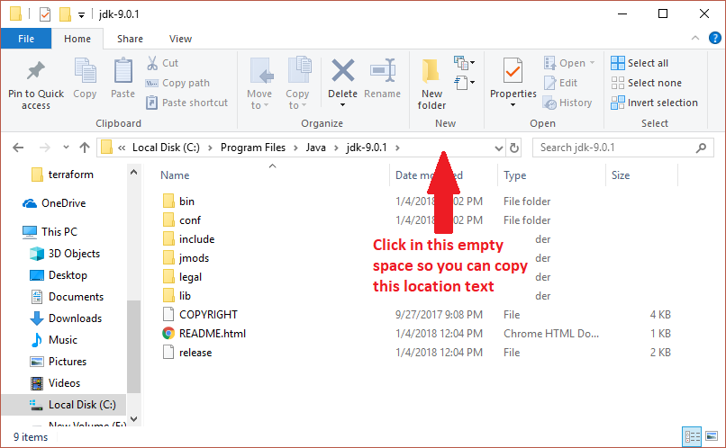
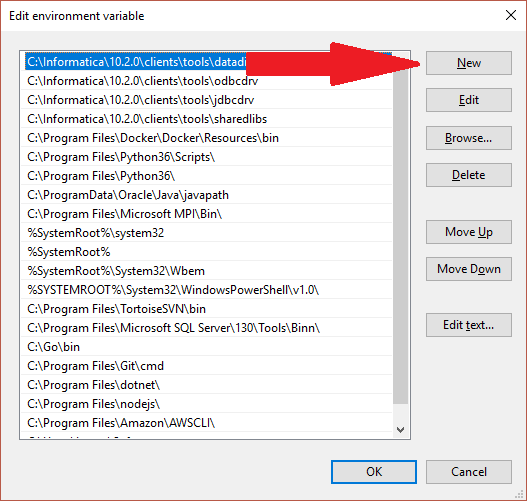

# Class 1

## Installing Our Tools
### Text Editor
First, go download [Atom](https://atom.io/). Atom is a text editor specifically made for writing code. It writes in "plain text". This is different from "rich text" editors like Microsoft Word or Mac TextEdit. Plain text has no formatting - no fonts, tables, font size, etc. It is purely text. Rich text editors include a bunch of extra information to make text look a certain way. This isn't good for programming because it confuses the computer. We want to use plain text.

### Java Software Development Kit (JDK)
Now we need to download Java.
1. Go the [JDK download page](http://www.oracle.com/technetwork/java/javase/downloads/jdk9-downloads-3848520.html)
2. Click the circle for "Accept License Agreement"
3. Click the download for either macOS or Windows corresponding to your computer
4. In your downloads folder, open the installer and progress through it as normal

#### Windows Setup
If you're on a Mac, you can ignore this. On Windows, we need to do some extra setup.

1. Open up editing system properties
  1. Hit the Windows key or click the Windows icon
  2. Type "system environment"
  3. Click "Edit the system environment variables"
    * 
  4. Click "Enivronment variables..."
    * 
2. Setup `JAVA_HOME`
  1. Click "New..."
    * 
  2.  Get the Java Path
    1. Open Windows Explorer
    2. Navigate to `C:\Program Files\Java`
    3. Open the folder that says `jdk` with the highest number
    4. Click in the location bar and copy the text (don't close this window yet!)
      * 
  3. Back in the "New..." Window you brought up in step 2.1, enter `JAVA_HOME` as the name, and the text you copied in step 2.2.4 as the value
    * 
  4. Click OK
3. Setup the Java executables in `PATH`
  1. In the bottom pane, find the `Path` variable
  2. Click "Edit..."
    * 
  3. Back in the Windows Explorer window from step 2.2.4, open the `bin` folder and copy that location
  4. Back in the "Edit..." window, click New
    * 
  5. Paste the location you copied and hit "enter"
    * 
  6. Click OK
4. Keep clicking OK until everything is done. You can close the Windows Explorer window, too.

Now, you've setup Java to use on your computer. Good job!

## Using Command Line
Command line is another way of looking at files. Using Windows Explorer or Mac Finder are how we normally look at files on the computer. There's a window, and it has folder icons with names and other information. Many people are comfortable with this way of interacting with a computer.

Before Explorer and Finder, there was Command Line. Instead of clicking folder icons and file names, people would type commands. These commands would open folders, run programs, edit text, and more. We're going to learn some of these commands now.

Unfortunately, Windows and Mac have different Command Line programs, and therefore, different ways to interact with files. We'll cover these separately.

### Windows
#### Opening Command Line
1. Click the Windows icon or press the Windows key on your keyboard to bring up the Start Menu.
2. Type in `cmd`. Command Prompt should show as a result
3. Hit Enter on your keyboard. This will open the command line
  * The Command Prompt should be a black window with white text

#### Using the Command Line
The command line does not use the mouse. I repeat: **the command line does not use the mouse**. Don't try to click to start typing in a different spot. It won't work. The command line was created before the mouse.

Every time you hit "enter" on command line, it's completely new text. Try it now. You'll see new lines pop up. If you try hitting "up" on your keyboard, your cursor won't move. It will instead bring up the last command you used (if any).

#### Commands

### Mac

## Writing our First Program

In programming tradition, it's best to write a simple program that prints "hello world" to the screen. This is to prove that our system is setup correctly and that we can safely run programs.

```java
System.out.println("Hello world")
```
This is called the `println` (print line) function. It prints text to the console. Note that I say it says "prints" text to the console. This is not "output". "output" means something very different that we'll cover later.
